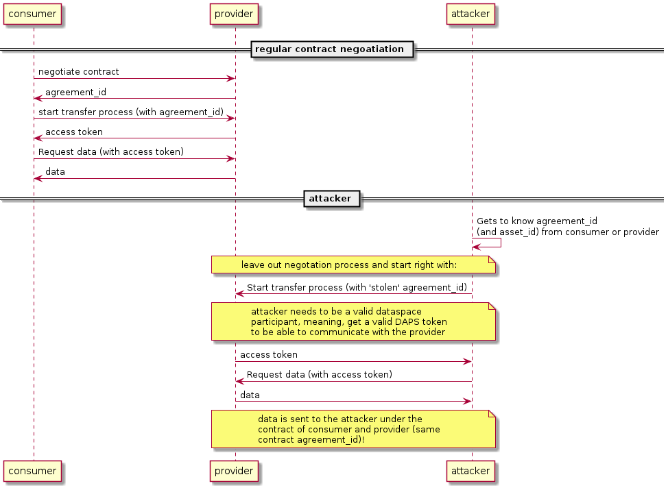

# Agreement Reuse Demo

In product-edc 0.3.0 (and earlier) a consumer (attacker) seems to be able to start a transfer process without running through a negotation process before. The attacker can simple re-use someone elses agreement_id (negotiated contract).

## Access Policies
**Untested**, but from what I can say: do not have any impact. Meaning, EDC Access Policies can NOT stop the attack.

# Flow

# Criticality
- attacker needs to be an authenticated participant of the datasapace (receive a valid DAPS token)
- attacker needs to know the agreement_id (negotated contract) and its asset_id
- attacker needs knowledge to change the attacker's EDC instance (disable state machine) or use an alternative protocol implementation, e.g. from this repository `core` compoments and `cli`

# Files
`test_agreement_reuse_consumer_with_edc.py` tries the attack with an EDC on attacker side. Fails because of state machine issues (according to the log).

`test_pycxids_agreement_reuse.py` works with the alternative protocol implementation form `core` module of this repository.
