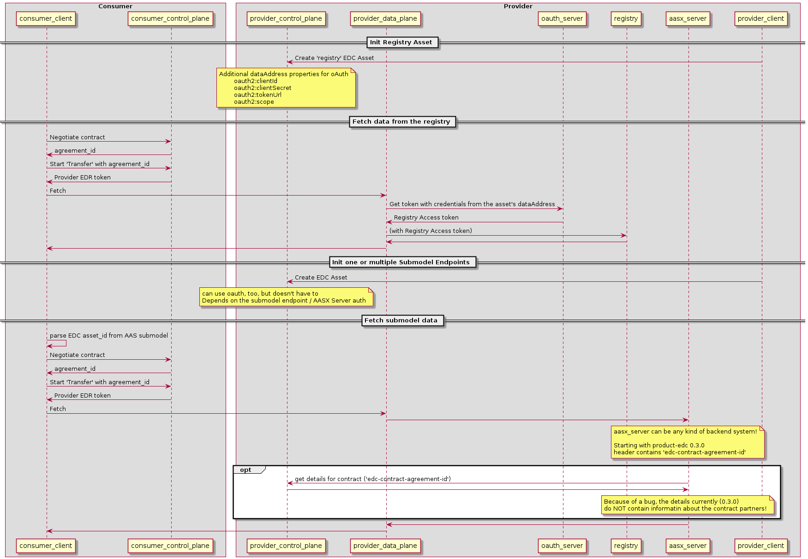

# Registry behind EDC

With `decentralized registries`, each oragnization runs its own AAS registry and protects it with EDC in front of it.

EDC grants access and checks data usage.

The following flow (and code in this directory) demonstrates how this can be done with a registry and a AAS submodel endpoint. The registry uses oauth for authentication between EDC data plane and the registry itself.

The sumbodel endpoint in this demo does not use any authentication. If desired, it could also use oauth or apiKey mechanism.

