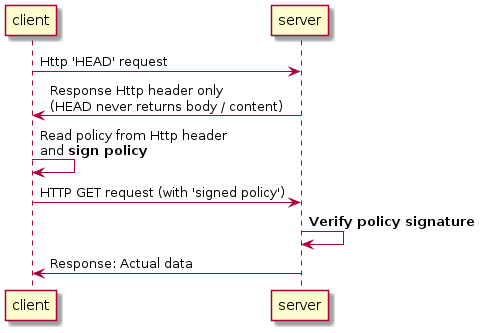

# PTT - policy transfer token
PTT (policy transfer token) is a very lean approach to transfer / agree to usage policies.

A usage policy is a policy that describes how the already transferred data needs to be handled on the consumer side. This means it could describe how long the data is allowed to be used or for what purpose.

It must be clear that this very lean approach differentiates from other solutions for this problem. Mainly:
- Negotiation of the policy is not the focus (even though it is possible)
- It typically deals with policies the Provider defines

Same as in other solutions, an *enforcement* of the policy is not possible. In theory there are ways to enforce the policy on the consumer side, but only with huge technical effort (DRM, secure computing stacks).

In the meantime, legal contracts are the basis for trust between Provider and Consumer to obey the policies.

A midterm approach can be called *trust based policy execution*. Still, no enforcement, but with the help of technical building blocks, the legal contracts basis could be enhanced. SSI (Self Sovereign Identity) and VC (Verifiable Credentials) and Organization Identities (e.g EUID) can help to minimize legal 'paper' contracts and substitude parts with agreements and certificates based on those trustful identities.

# Technical description
The solution is based on typicall HTTP. A GET request transfers the policy information in its headers.
To get the policy without any data first, a simple HTTP HEAD is used. In case the provider want a signed agreement / policy, the consumer needs to fetch the policy first (HEAD request), understand the policy, sign it and send it as part of the HTTP header with the GET request. By doing this, also one policy out of a selction could be selected and used for the actual data request, meaning the consumer has the choice under which policy they want to fetch the data.

## Flows
The general flow is very simple:

The details depend on the different variations of how the authenticity of the signed policy is verified.

### via DAPS
'daps signing' is rather an indirect signing. The signature that is verified on the server is from the DAPS (easier because it is only 1), but the clients did authenticate at the DAPS.

### via 'pinned' x509 certificate
The certificate is uploaded to the server and thus, kown to the server. The registration process needs to be carefully designed to make sure the server can trust the certificates.

### via CA signed x509 certificate
TODO
### via SSI
TODO
