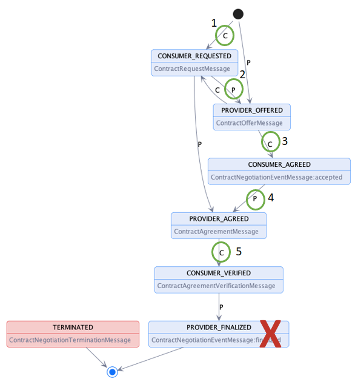
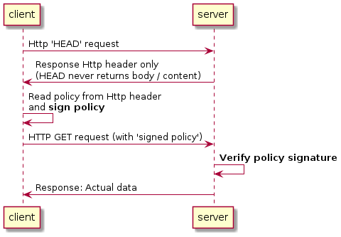
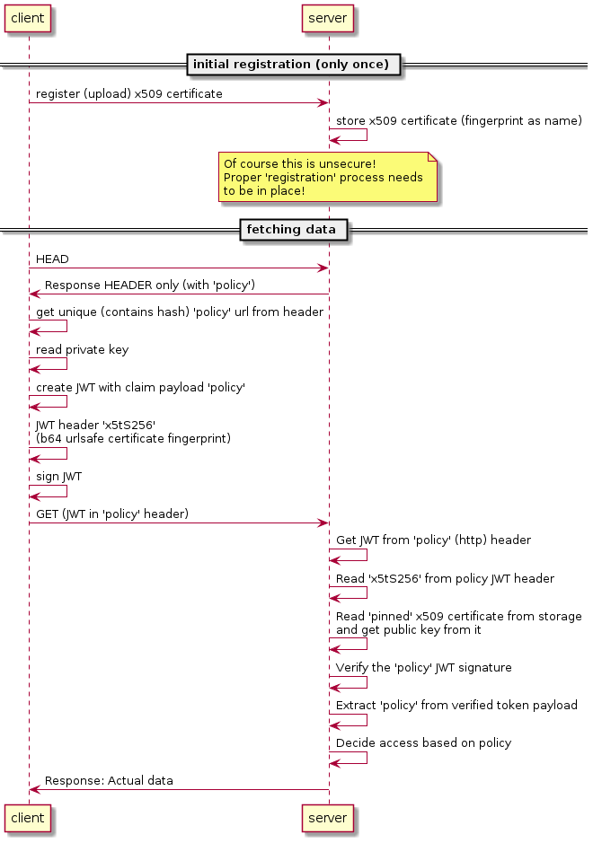

# Simple Policy Transfer Binding - a DRAFT version
This is a binding for a very simple approach to return data only when a given policy has been signed. It can be easily applied to e.g. AAS (Asset Administration Shell).

## General - TODO
This IDS protocol binding is clearly syncronous instead of async communication in the regular `https` binding.


### TODO
As described in [Information Model - Offer](https://docs.internationaldataspaces.org/dataspace-protocol/overview/model#2.2.3-offer), the offer MUST NOT include a `target` because it gets it implicitly from its eclosing context.

On the other hand, an `agreement` MUST include a `target` which identifies exactly 1 `asset`.


# Binding state machine


1: HEAD request​

2: HEAD response with 'Policy' Http header containing a URL with hash identifier of the policy (in case only 1 policy is allowed) OR 'Dataset' header with a link to a dcat dataset endpoint from which a policy can be selected.​

3: Consumer signs policy hash and sends it as Http Header 'Policy' field (jwt)​

4: Provider sends Http status code other than 403 Forbidden. That can be any status code that might happen during a data transfer​

Data Space decision (1 of the following options) in the 'Policy' Http header in the Response:​

Provider sends policy hash applying to the data response (no link to the request)​

Provider sends cross-signed policy (response linked to the request)​

Provider sends the cross-signed policy + content hash (response linked to the request AND data content)​

5: Consumer checks response 'Policy' header and terminates the protocol state machine.​

​

Provider_Finalized state does NOT exist in this binding.​

Any Http error status code terminates the protocol state machine.​

State machine can also be started with 3) alternatively.​

​
Detailed descriptions in the following sections
​

# Catalog Binding

## 1 Introduction
This specification defines a HTTP method binding for the Catalog Protocol.

This binding does explicitly remove the `/catalog` endpoint! It rather provides
individual endpoints, mainly RESTful endpoints to query `policies` or `datasets` from. A `dataset` can contain multiple `policies`.

The resource itself is discovered via an out-of-band process. E.g. using a AAS (asset administration shell) registry or any other lookup system to identify the desired resource.

## 2 Path Bindings

### 2.1 `catalog/request` endpoint
NOT valid for this binding and replaced with

### 2.2 HTTP HEAD request to the resource
A HTTP *HEAD* request to the desired resource returns no content / body, but only headers.
The response header contains either:

#### Option 1
An https binding compliant `dataset` endpoint:
```
HEAD https://servername/myresource/12345

Dataset: https://servername/catalog/dataset/1

```
The `Dataset` Header field contains the information which `Dataset` / `Asset` is relevant for this resource. This needs to be fetched. It contains a list of `offers`:
```
GET https://servername/catalog/dataset/1

{
    // dcat dataset structure, including offers with policies
}
```

**Prerequisite 1: policies inside the dataset must be identifiable by a unique hash / hash url for the later shortened negotiation / transfer process.**

**Prerequisite 2: The `target` istself *MUST NOT* be part of the policy! The binding between policy AND resource happens in a different manner. It is an implicit binding by the context of the requested resource**

#### Option 2:
A Policy-Hash Endpoint, pointing to a policy that applies to the content of that resource, hashed and thus uniquely identifiable. This option is a short-hand option in case only 1 policy is possible with the requested resource and the consumer doesn't have a way to select from a list ('...take it or leave it...'):
```
HEAD https://servername/myresource/12345

Policy: https://servername/policies/sha256-123X

```


### 2.3 `catalog/datasets{id}` endpoint
Same as in the https binding. Only relevant for *Option 1.*

TODO: quniquely identifiable policies in the form of hasehed URLs
TODO: `target` *MUST NOT* be part of the policy
TODO: example

### 2.4 `policies/{policy_hash}` endpoint
Extends the `dcat catalog` by a `policy repository`
Returns the policy content via the requested policy hash. 


# Contract Negotiation Binding

## Introduction
A negotiation process WITH *counter offers* is out of scope! The typical case is that a provider sets the policies that neeed to be accepted.

The `negotiation` is mainly a consumer internal decision whether to accept one of the offers or not and subsequently signing the policy-hash (url).

# Transfer Binding

## Introduction
The transfer is initiated with a HTTP *GET* request to the resource.

It needs to contain a signed policy requested via the `catalog` process before.

## Authorization
Request:
```
GET https://servername/myresource/12345

Policy: base64(signed(jwt(payload: 'policy-sha256-123X)))

```
JWT payload example:
```
{
    "policy": "https://servername/policies/sha256-123X",
    "audience": "https://servername/myresource/12345"
}
```

Response:
```
Header:
Policy: https://servername/policies/sha256-123X

Payload:
{
    "hello": "world"
}
```

The provider can easily store the `Policy` JWT for later prove that the consumer consumed a specific resource (`audience`) under a given (signed) usage policy.

Optionally, the response can be signed, too, for the consumer to have a prove which policy was required to being applied to the recieived data.
```
Header:
Policy: provider_signature(consumer_policy_token, Policy)

Payload:
{
    "hello": "world"
}
```

# Token Signing
There are multiple existing signing approaches. It's up to the dataspace to decide which one applies. The following section is a non-normative list of examples:

## General Flow


## x509 with trusted root CA
TODO

## x509 with pinned certificates


## indirect signing via an auth server, e.g. DAPS


## SSI based signing
TODO

## SSI with Verifiable Credentials signing
TODO
